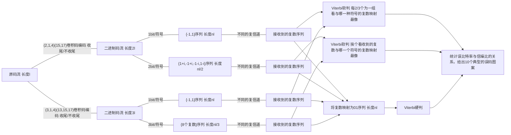

# 编码第一次大作业 流程图

```mermaid
flowchart LR
    Origin[原码流 长度l]
    
    Origin--"(2,1,4)(15,17)卷积码编码 收尾/不收尾"---Coded12[二进制码流 长度2l]
    Origin--"(3,1,4)(13,15,17)卷积码编码 收尾/不收尾"---Coded13[二进制码流 长度3l]
    
   BinaryArrayMapping["将复数映射为01序列 长度nl"]-->HardViterbi["Viterbi硬判"]
    
    Coded12--"1bit/符号"---Sent1["{-1,1}序列 长度nl"]--"不同的复信道"---Received1["接收到的复数序列"]-->BinaryArrayMapping
    Coded12--"2bit/符号"---Sent2["{1+i,-1+i,-1-i,1-i}序列 长度nl/2"]--"不同的复信道"---Received2["接收到的复数序列"]-->BinaryArrayMapping
    Coded13--"1bit/符号"---Sent3["{-1,1}序列 长度nl"]--"不同的复信道"---Received3["接收到的复数序列"]-->BinaryArrayMapping
    Coded13--"3bit/符号"---Sent4["{8个复数}序列 长度nl/3"]--"不同的复信道"---Received4["接收到的复数序列"]-->BinaryArrayMapping
    
    Received1-->SoftViterbiSingle["Viterbi软判 每2/3个为一组 看与哪一种符号的复数映射最像"]
    Received3-->SoftViterbiSingle
    
    Received2-->SoftViterbiMultiple["Viterbi软判 挨个看收到的复数与哪一个符号的复数映射最像"]
    Received4-->SoftViterbiMultiple
    
    SoftViterbiSingle-->Analysis["统计误比特率与信噪比的关系，给出10个典型的误码图案"]
    SoftViterbiMultiple-->Analysis
    HardViterbi-->Analysis
```